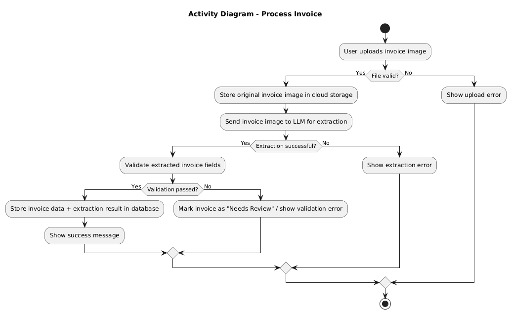
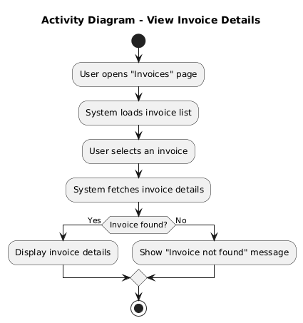

# Activity Diagrams

## Overview
This document contains activity diagrams that model the business processes and workflows.

## Activity Diagram 1: Process Invoice

### Description
The user uploads an invoice image. The system stores the image in cloud storage, extracts structured data using the 
LLM, validates the extracted fields, saves the invoice data in the database, and returns the processing result to the
user.
### Diagram

### Actors
- User
- IntelliInvoice System
- LLM Service (external)
- Cloud Storage (external)

### Activities
1. User uploads invoice image
2. System checks file format and size
3. System stores the original invoice image in cloud storage
4. System sends invoice image to the LLM for data extraction
5. System validates the extracted fields
6. System stores the invoice data (and extraction result) in the database
7. System shows a success or failure message to the user

### Decision Points
- File valid? (Yes → store image in cloud, No → show upload error and stop)
- Extraction successful? (Yes → validate extracted data, No → show extraction error and stop)
- Validation passed? (Yes → store invoice data in database, No → mark as “Needs Review” or show validation error)

## Activity Diagram 2: View Invoice Details

### Description
User views their stored invoices, selects one invoice, and sees its details. If the invoice doesn’t exist,
the system shows an error.

### Diagram

### Actors
- User
- IntelliInvoice System

### Activities
1. User opens “Invoices”
2. System loads invoice list
3. User selects an invoice
4. System fetches invoice details
5. System displays invoice details

### Decision Points
- Invoice found? (Yes → display details, No → show “Not Found”)

## Notes
The diagrams illustrate the main invoice processing workflows. External services (LLM and cloud storage) are
included in the flow but are outside the system boundary. Error handling is simplified for clarity.