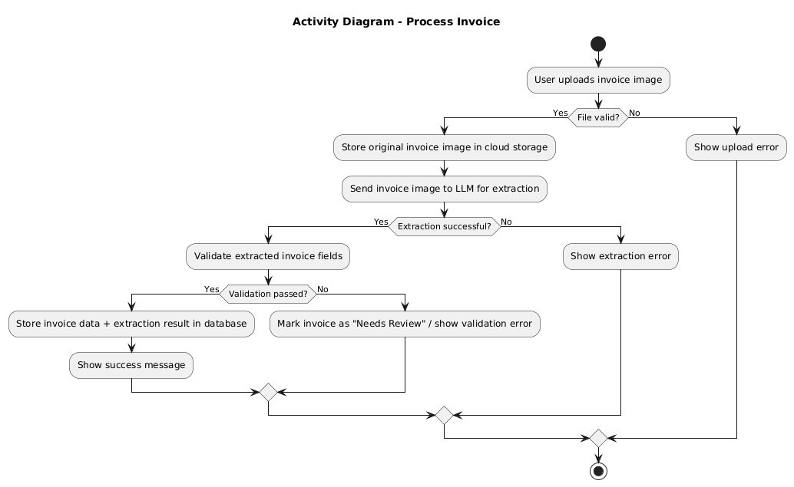
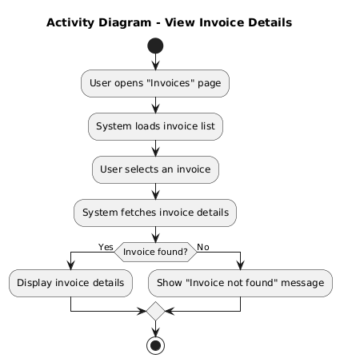

# Activity Diagrams

## Overview

This document contains activity diagrams modelling the main workflows
of the IntelliInvoice system.

---

## Activity Diagram 1: Upload and Process Invoice

### Description

The user uploads an invoice image or PDF through the Angular UI.
The system validates the file, uploads it to AWS S3, sends the image
URL to Claude Sonnet AI for data extraction, validates the extracted
data, and saves everything to the PostgreSQL database.

### Diagram

### Actors

- User
- Angular Frontend
- Quarkus Backend
- Claude Sonnet AI (external)
- AWS S3 (external)
- PostgreSQL

### Activities

1. User selects an invoice file (JPG, PNG, or PDF)
2. System validates file format and MIME content type
3. System uploads the file to AWS S3 and receives the image URL
4. System sends the image URL to Claude Sonnet AI
5. Claude Sonnet extracts store name, date, total, VAT,
   invoice number, and line items
6. System validates extracted data:
   line items + VAT must equal total amount
7. System calculates return status and days remaining
8. System saves invoice and line items to PostgreSQL
9. Angular UI displays success screen with extracted data

### Decision Points

- **File valid?**
  Yes → upload to S3
  No → return INVALID_FILE_FORMAT error to Angular UI

- **AI extraction successful?**
  Yes → validate extracted data
  No → return INVALID_INVOICE_DATA error to Angular UI

- **Math validation passed?**
  Yes → calculate return status and save to database
  No → return INVALID_INVOICE_DATA error with mismatch details

- **Database save successful?**
  Yes → show success screen in Angular UI
  No → return DATABASE_ERROR to Angular UI

---

## Activity Diagram 2: View and Manage Invoices

### Description

The user opens the Invoice List page, views all stored invoices
with return status and thumbnails, and can search, filter,
view details, or delete an invoice.

### Diagram

### Actors

- User
- Angular Frontend
- Quarkus Backend
- PostgreSQL

### Activities

1. User navigates to the Invoice List page
2. System loads all invoices from PostgreSQL
3. System calculates return status and days left for each invoice
4. Angular UI displays invoices with status badges and thumbnails
5. User searches by store name or applies a status filter
6. User selects an invoice to view details
7. System fetches full invoice data including line items
8. Angular UI displays invoice detail with original image from S3
9. User optionally deletes the invoice with confirmation

### Decision Points

- **Invoices found?**
  Yes → display invoice table
  No → display "No invoices found"

- **Search results found?**
  Yes → update table with matching invoices
  No → display "No invoices found"

- **Invoice found by ID?**
  Yes → display invoice detail page
  No → display INVOICE_NOT_FOUND error

- **User confirms delete?**
  Yes → delete invoice and line items from database
  No → cancel and return to invoice list

---

## Activity Diagram 3: View Spending Analytics

### Description

The user opens the Analytics page and views spending charts
for a selected year and month. The system calculates totals
from stored invoices and renders interactive Chart.js charts.

### Diagram

### Actors

- User
- Angular Frontend
- Quarkus Backend
- PostgreSQL

### Activities

1. User navigates to the Analytics page
2. System loads all invoices from PostgreSQL
3. System calls GET /myinvoices/spending for the selected period
4. Angular calculates monthly totals, quarterly breakdown,
   and top 5 stores
5. Angular renders three Chart.js charts:
   monthly bar chart, quarterly donut, top stores horizontal bar
6. User selects a different year or month and clicks Apply
7. Charts update to reflect the new period

### Decision Points

- **Data available for selected period?**
  Yes → render charts with real data
  No → charts display zero values

---

## Notes

All error handling uses the ErrorCode enum:
INVALID_FILE_FORMAT, FILE_UPLOAD_FAILED, INVALID_INVOICE_DATA, DATABASE_ERROR, INVOICE_NOT_FOUND.
External services (AWS S3 and Claude Sonnet AI) are outside the system boundary
but are required for core upload functionality.