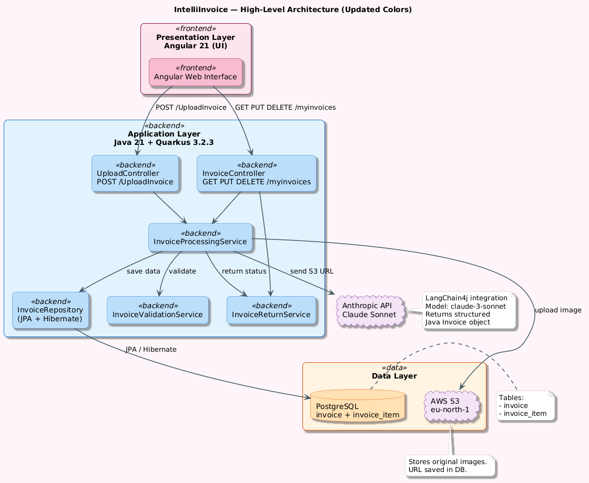

# Architecture Overview

## Introduction

This document describes the high-level architecture of the IntelliInvoice system.
The system allows a user to upload invoice images, automatically extract structured
data using Claude Sonnet AI, store the results in the cloud, and manage invoices
through a modern Angular web interface.

---

## Architecture Style

**Layered 3-tier architecture** with a clear separation between
frontend, backend, and data layer.

| Layer        | Technology                    | Responsibility                   |
|--------------|-------------------------------|----------------------------------|
| Presentation | Angular 21 + Angular Material | User interface                   |
| Application  | Java 21 + Quarkus 3.2.3       | Business logic + REST API        |
| Data         | PostgreSQL + AWS S3           | Data persistence + image storage |

---

## High-Level Architecture Diagram

---

## System Components

### Frontend — Angular 21

- Upload invoice images via drag-and-drop or file browser
- Display invoice list with return status badges and image thumbnails
- Show invoice detail with original image loaded from AWS S3
- Visualise spending analytics with Chart.js (monthly, quarterly, top stores)
- Communicates with Quarkus backend via REST API

### Backend — Quarkus 3.2.3

Follows a clean 3-layer architecture internally:

- **Controller layer** — `InvoiceController` and `UploadController`
  handle all incoming HTTP requests and return JSON responses
- **Service layer** — `InvoiceProcessingService` orchestrates the full
  upload and extraction flow. `InvoiceReturnService` calculates return
  status and days remaining. `InvoiceValidationService` validates
  file format and extracted data
- **Repository layer** — `InvoiceRepository` handles all database
  operations via JPA and Hibernate

### Database — PostgreSQL

- Stores all invoice metadata and line items
- Two tables: `invoice` and `invoice_item` (one-to-many relationship)
- UUID as primary key for all records
- Cascade delete — removing an invoice removes all its line items

### Cloud Storage — AWS S3 (eu-north-1)

- Stores original uploaded invoice images
- Returns a public image URL saved in the database
- Images are loaded directly by the Angular UI via the stored URL

### AI Service — Claude Sonnet (Anthropic)

- Receives the S3 image URL via LangChain4j
- Extracts store name, date, total amount, VAT,
  invoice number, and line items
- Returns structured data mapped directly to a Java `Invoice` object

---

## Key Architectural Decisions

**1 — Claude Sonnet AI instead of classic OCR**
LLM-based extraction produces structured data directly without manual
parsing rules. More flexible and accurate for varying invoice formats
across different stores.

**2 — Maven multi-module project**
Backend and frontend are separate Maven modules under one parent POM.
One `mvn package` command builds everything into a single deployable JAR.

**3 — AWS S3 for image storage**
Only the S3 URL is stored in the database — no binary data in PostgreSQL.
Keeps the database lightweight and images accessible from anywhere.

**4 — DTO pattern for API responses**
`InvoiceResponseDTO` separates the database entity from the API response.
The frontend never receives raw JPA entities directly — only the fields
needed for the UI are exposed.

**5 — Custom error handling**
A dedicated `ErrorCode` enum and `InvoiceValidationException` class ensure
all errors are caught, categorised, and returned with meaningful messages
to the Angular UI. Error codes: `INVALID_FILE_FORMAT`, `FILE_UPLOAD_FAILED`,
`INVALID_INVOICE_DATA`, `DATABASE_ERROR`, `INVOICE_NOT_FOUND`.

---

## Quality Attributes

| Attribute       | How it is addressed                                                     |
|-----------------|-------------------------------------------------------------------------|
| Maintainability | Clean 3-layer architecture with clear separation of concerns            |
| Data integrity  | Math validation: line items + VAT must equal total before saving        |
| Security        | AWS credentials and API keys stored only in environment variables       |
| Error handling  | Custom ErrorCode enum covers all failure scenarios                      |
| Usability       | Angular UI provides loading states, success screens, and error messages |

---

## Constraints and Limitations

- Single user system — no authentication or login implemented
- AI extraction quality depends on the clarity of the uploaded image
- System depends on two external services: AWS S3 and Anthropic Claude API
- Camera capture is not supported — users must upload existing files

---

## Future Considerations

- Add JWT-based authentication and multi-user support
- Native mobile app with direct camera capture for instant receipt scanning
- CI/CD pipeline and production cloud deployment
- AI-powered purchase recommendations and wardrobe insights