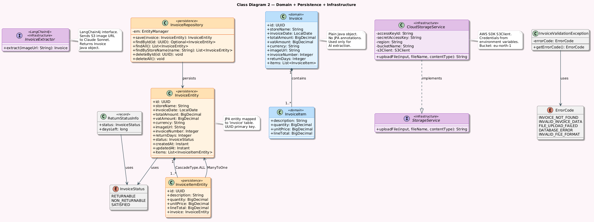

# Class Diagrams

## Overview

This document contains UML class diagrams for the IntelliInvoice
backend system, reflecting the actual implemented Java classes.

---

## Class Diagram 1: REST API + Service Layer

### Description

Shows the request flow from Angular through the controllers
to the service layer. Controllers receive HTTP requests and
delegate all business logic to the service layer.

### Diagram

---

## Class Diagram 2: Domain + Persistence + Infrastructure

### Description

Shows the core business objects, JPA entities, repository,
AI extractor interface, cloud storage, and error handling classes.

### Diagram

---

## Design Patterns Used

- **Layered Architecture** — Controller → Service → Repository → Database
- **Adapter Pattern** — `CloudStorageService` implements `StorageService`
  interface, hiding AWS SDK details from the service layer
- **Repository Pattern** — `InvoiceRepository` abstracts all database
  operations from the service layer
- **DTO Pattern** — `InvoiceResponseDTO` separates JPA entities
  from API responses
- **Dependency Injection** — Quarkus CDI injects all services
  automatically using `@Inject`