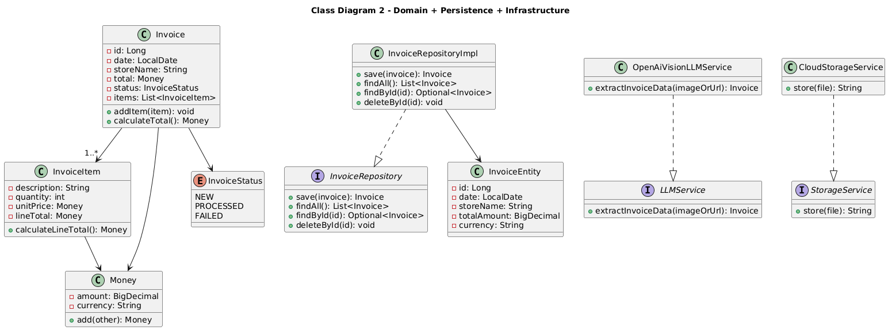

 # Class Diagrams

## Overview
This document contains UML class diagrams for the IntelliInvoice backend system design.

## Class Diagram 1: REST API + Service Orchestration

### Description
Shows the main request flow: controllers receive HTTP requests and delegate to the service layer to process invoices.

### Diagram

### Key Classes

#### Class: UploadController
**Responsibilities:**
- Receive invoice upload requests
- Forward request to `InvoiceProcessingService`
 
**Attributes:**
- invoiceProcessingService: InvoiceProcessingService - Service dependency (in order to call the 
  InvoiceProcessingService class  and process the invoice)

**Methods:**
- `uploadInvoice(invoiceImage): ApiResponse` - Upload and start processing
**Relationships:**
- Depends on InvoiceProcessingService

#### Class: InvoiceController
**Responsibilities:**
- Provide endpoints to list, view, and delete invoices
- Delegate operations to service/repository

**Attributes:**
- `invoiceRepository: InvoiceRepository` - Persistence access (or via service to the database)

**Methods:** 
- `listInvoices(): List<Invoice>` - Returns all invoices
- `getInvoice(id): Invoice` - Returns one invoice
- `deleteInvoice(id): void` - Deletes invoice by id

**Relationships:**
- Depends on `InvoiceRepository` (or a service)

#### Class: InvoiceProcessingService
**Responsibilities:**
- Handles full invoice workflow
- Coordinate storage + LLM extraction + validation + persistence

**Attributes:**
- `storageService: StorageService` - Stores original invoice image
- `llmService: LLMService` - Extracts structured invoice data
- `validationService: InvoiceValidationService` - Validates extracted data
- `invoiceRepository: InvoiceRepository` - Saves invoice data

 **Methods:**
- `processInvoice(invoiceImage): Invoice` - Full processing workflow

**Relationships:**
- Uses `StorageService`
- Uses `LLMService`
- Uses `InvoiceValidationService`
- Uses `InvoiceRepository`

#### Class: InvoiceValidationService
**Responsibilities:**
- Validate invoice fields and totals
- Raise errors when data is invalid
**Attributes:**
- (none)
**Methods:**
- `validate(invoice): void` - Validates invoice object
**Relationships:**
- Used by `InvoiceProcessingService`
- Throws `AppException`

## Class Diagram 2: Domain + Persistence + Infrastructure

### Description
Shows the core business entities and how database/infrastructure implement interfaces from the service layer.

### Diagram

### Key Classes

#### Class: Invoice
**Responsibilities:**
- Represent an invoice in the business domain
- Hold invoice header + items

**Attributes:**
- `id: Long` - Invoice identifier
- `date: LocalDate` - Invoice date
- `storeName: String` - Store name
- `total: Money` - Total amount
- `status: InvoiceStatus` - Processing status
- `items: List<InvoiceItem>` - Invoice line items

**Methods:**
- `addItem(item): void` - Add invoice item
- `calculateTotal(): Money` - Calculates total from items (optional)

**Relationships:**
- Contains `InvoiceItem` (1..*)
- Uses `Money`
- Uses `InvoiceStatus`

#### Class: InvoiceItem
**Responsibilities:**
- Represent a single invoice line item

**Attributes:**
- `description: String` - Item name/description
- `quantity: int` - Quantity
- `unitPrice: Money` - Price per unit
- `lineTotal: Money` - Total for this line

**Methods:**
- `calculateLineTotal(): Money` - quantity × unitPrice (optional)

**Relationships:**
- Part of `Invoice`
- Uses `Money`

#### Class: Money
**Responsibilities:**
- Represent monetary values safely

**Attributes:**
- `amount: BigDecimal` - Numeric amount
- `currency: String` - Currency (e.g., EUR)

**Methods:**
- `add(other): Money` - Adds money values (optional)

**Relationships:**
- Used by `Invoice` and `InvoiceItem`

#### Class: InvoiceStatus (enum)
**Responsibilities:**
- Represent invoice processing state

**Attributes:**
- `NEW`
- `PROCESSED`
- `FAILED`

**Methods:**
- (none)

**Relationships:**
- Used by `Invoice`

#### Interface: InvoiceRepository
**Responsibilities:**
- Provide persistence operations for invoices

**Attributes:**
- (none)

**Methods:**
- `save(invoice): Invoice` - Save invoice
- `findAll(): List<Invoice>` - List all invoices
- `findById(id): Optional<Invoice>` - Get invoice by id
- `deleteById(id): void` - Delete invoice

**Relationships:**
- Implemented by `InvoiceRepositoryImpl`

#### Class: InvoiceRepositoryImpl
**Responsibilities:**
- Implement invoice persistence
- Map between entity and business objects

**Attributes:**
- (optional) `entityManager: EntityManager` - DB access (if using JPA)

**Methods:**
- `save(invoice): Invoice`
- `findAll(): List<Invoice>`
- `findById(id): Optional<Invoice>`
- `deleteById(id): void`

**Relationships:**
- Implements `InvoiceRepository`
- Uses `InvoiceEntity`

#### Class: InvoiceEntity
**Responsibilities:**
- Database representation of an invoice

**Attributes:**
- `id: Long`
- `date: LocalDate`
- `storeName: String`
- `totalAmount: BigDecimal`
- `currency: String`

**Methods:**
- (none)

**Relationships:**
- Used by `InvoiceRepositoryImpl`

#### Interface: LLMService
**Responsibilities:**
- Provide invoice extraction from image (external AI)

**Attributes:**
- (none)

**Methods:**
- `extractInvoiceData(imageOrUrl): Invoice` - Extract structured invoice data

**Relationships:**
- Implemented by `OpenAiVisionLLMService`

#### Class: OpenAiVisionLLMService
**Responsibilities:**
- Call external Vision LLM provider
- Convert response into `Invoice`

**Attributes:**
- (optional) `client: OpenAIClient` - Provider client

**Methods:**
- `extractInvoiceData(imageOrUrl): Invoice`

**Relationships:**
- Implements `LLMService`
- Creates `Invoice`

---

#### Interface: StorageService
**Responsibilities:**
- Store original invoice image externally

**Attributes:**
- (none)

**Methods:**
- `store(file): String` - Returns URL or storage key

**Relationships:**
- Implemented by `CloudStorageService`

#### Class: CloudStorageService
**Responsibilities:**
- Upload invoice image to cloud storage
- Return storage URL/key

**Attributes:**
- (optional) `bucketName: String` - Storage bucket/container

**Methods:**
- `store(file): String`

**Relationships:**
- Implements `StorageService`

#### Class: AppException
**Responsibilities:**
- Represent application-specific errors

**Attributes:**
- `code: ErrorCode` - Error type
- `message: String` - Error message

**Methods:**
- `getCode(): ErrorCode`

**Relationships:**
- Thrown by services/controllers

#### Class: ErrorCode (enum)
**Responsibilities:**
- Central list of error codes

**Attributes:**
- `INVALID_INVOICE`
- `LLM_FAILED`
- `STORAGE_FAILED`
- `NOT_FOUND`

**Methods:**
- (none)

**Relationships:**
- Used by `AppException`

## Design Patterns Used
- **Layered Architecture:** REST API → Service → Domain + (Database/Infrastructure)
- **Adapter Pattern:** `OpenAiVisionLLMService` and `CloudStorageService` adapt external systems behind interfaces
- **Repository Pattern:** `InvoiceRepository` abstracts persistence operations

## Notes
- Keep the diagrams small: only show the main classes and the key relationships.
- Interfaces (`LLMService`, `StorageService`, `InvoiceRepository`) help avoid tight coupling and prevent cyclic dependencies.

