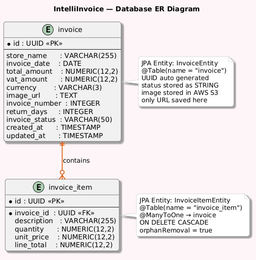

# Data Model and Database Mapping

## Overview

This document describes the IntelliInvoice data model and how it maps
to the PostgreSQL database schema. The system uses **Hibernate/JPA**
for automatic ORM mapping. Original invoice images are stored in
AWS S3 — only the URL is saved in the database.

---

## Entity-Relationship Diagram

**Invoice (1) ─── (N) InvoiceItem**

One invoice contains one or more line items.
Deleting an invoice automatically deletes all its line items
via CascadeType.ALL.

---

## Logical Data Model

### Invoice

Stores extracted invoice header data and the AWS S3 image URL.

| Attribute       | Type          | Description                             |
|-----------------|---------------|-----------------------------------------|
| `id`            | UUID          | Primary key — auto generated            |
| `storeName`     | VARCHAR(255)  | Extracted store name                    |
| `invoiceDate`   | DATE          | Extracted invoice date                  |
| `totalAmount`   | NUMERIC(12,2) | Total amount including VAT              |
| `vatAmount`     | NUMERIC(12,2) | VAT amount                              |
| `currency`      | VARCHAR(3)    | ISO currency code (e.g. EUR)            |
| `imageUrl`      | TEXT          | AWS S3 URL of original image            |
| `invoiceNumber` | INTEGER       | Extracted invoice number                |
| `returnDays`    | INTEGER       | Return window in days                   |
| `status`        | VARCHAR       | RETURNABLE / NON_RETURNABLE / SATISFIED |
| `createdAt`     | TIMESTAMP     | Record creation timestamp               |
| `updatedAt`     | TIMESTAMP     | Last update timestamp                   |

### InvoiceItem

Stores individual line items belonging to an invoice.

| Attribute     | Type          | Description                  |
|---------------|---------------|------------------------------|
| `id`          | UUID          | Primary key — auto generated |
| `invoice_id`  | UUID          | Foreign key → invoice(id)    |
| `description` | VARCHAR(255)  | Item description             |
| `quantity`    | NUMERIC(12,2) | Item quantity                |
| `unitPrice`   | NUMERIC(12,2) | Price per unit               |
| `lineTotal`   | NUMERIC(12,2) | quantity × unitPrice         |

---

## ORM Mapping — Hibernate / JPA

Tables are created and managed automatically by Hibernate —
no manual SQL scripts are required.

`InvoiceEntity` maps to the `invoice` table and
`InvoiceItemEntity` maps to `invoice_item`.
The relationship is handled via `@OneToMany(CascadeType.ALL)`
on the invoice side and `@ManyToOne @JoinColumn(name="invoice_id")`
on the item side. `InvoiceStatus` is stored as a readable string
using `@Enumerated(EnumType.STRING)`.

---

## Key Design Decisions

**1 — Image stored in AWS S3, not in the database**
Only the S3 URL is saved as TEXT. Keeps the database lightweight
and images accessible directly from the Angular UI.

**2 — UUID as primary key**
All records use UUID instead of auto-increment integers.
Avoids ID collisions and supports future distributed deployment.

**3 — InvoiceStatus stored as STRING**
Stores `RETURNABLE`, `NON_RETURNABLE`, `SATISFIED` as readable
strings — not numbers. Makes the database easier to read and debug.

**4 — CascadeType.ALL with orphanRemoval**
Deleting an invoice automatically deletes all its line items.
No orphaned records are left in the database.

---

## Future Considerations

- Introduce **Flyway** for versioned database migrations
- Add indexes on `store_name` and `invoice_date` for faster search
- Add user-specific invoice storage with authentication