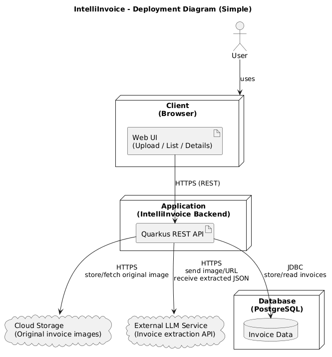

# Deployment Diagram

## Overview
This document describes the deployment architecture of **IntelliInvoice**.  
It shows where the backend, database, storage, and external LLM service run in **Dev / Test / Prod**.

## Deployment Diagram 

## Deployment Environments

### Development Environment
**Purpose:** Local development and quick testing on one machine.

**Nodes:**
- **Node 1:** Developer Laptop
  - **Type:** Workstation
  - **OS:** macOS 
  - **Components:**
    - IntelliInvoice Backend (Quarkus) – local run
    - PostgreSQL – local (Docker container planned)
    - Local file storage (for invoice images) *or* simple cloud bucket test
  - **Resources:**
    - CPU: 5 cores 
    - Memory: 8–16 GB
    - Storage: 5–10 GB free

### Testing Environment
**Purpose:** Test the full integration (Backend + Database + Storage + LLM) in a safe setup before production.

**Nodes:**
- **Node 1:** Test Setup (same machine / local)
  - **Type:** Workstation (Developer laptop)
  - **OS:** macOS
  - **Components:**
    - IntelliInvoice Backend (Quarkus) – running locally
    - PostgreSQL – running in Docker (test database)
    - Local folder or test cloud storage (invoice images)
    - External LLM service (separate test API key, if available)
  - **Resources:**
    - CPU: same as development laptop
    - Memory: same as development laptop
    - Storage: minimal (a few GB for test data)

### Production Environment
**Purpose:** Stable environment for real usage.

**Nodes:**
- **Node 1:** Cloud Application
  - **Type:** Cloud application service
  - **Components:**
    - IntelliInvoice Backend (Quarkus – Docker container)
  - **Resources:**
    - CPU: 5 cores
    - Memory: 4 GB
    - Storage: 10–20 GB

- **Node 2:** Cloud Database
  - **Type:** Managed database service
  - **Components:**
    - PostgreSQL database
  - **Resources:**
    - Managed by provider (automatic scaling and backups)

- **External Services (used by Production):**
  - Cloud Storage (original invoice images)
  - External LLM Service (Invoice data extraction API)

## Network Configuration

### Network Topology
- Client (Browser) connects to Backend via **HTTPS**
- Backend connects to:
  - Database via **internal network** (JDBC)
  - Cloud Storage via **HTTPS**
  - External LLM Service via **HTTPS**

### Communication Protocols
- **HTTPS**: Client → Backend, Backend → Cloud Storage, Backend → LLM API
- **JDBC (PostgreSQL)**: Backend → Database

### Firewall Rules

### Basic Security Rules
- Users can access the backend only via HTTPS.
- The database is not publicly accessible.
- Only the backend can connect to the database.
- The backend can securely connect to:
  - Cloud storage
  - External LLM service

## Deployment Procedures

### Deployment Steps
1. Build the backend application (Quarkus JAR).
2. Build Docker image for IntelliInvoice.
3. Deploy Docker container to cloud platform.
4. Configure environment variables:
  - Database connection (DB URL, username, password)
  - Cloud storage configuration
  - LLM API key
1. Start the application.
2. Test deployment:
  - Upload invoice
  - Verify image is stored
  - Verify extracted data is saved in PostgreSQL

### Rollback Procedures
1. Re-deploy the previous stable backend version.
2. Restore the latest database backup if data is affected

## Monitoring and Logging

### Monitoring
- Application health endpoint to check if the service is running.
- Docker/container logs to monitor runtime behavior.

### Logging Strategy
- Log important processing steps:
  - Invoice upload received
  - Image stored successfully
  - LLM request sent and response received
  - Invoice data saved in database
- Log errors for debugging.
- Never log sensitive information (e.g., passwords or API keys).

## Backup and Disaster Recovery

- The database is backed up regularly (manual or managed by cloud provider).
- Original invoice images are stored in cloud storage.

### Restore Plan
1. Restore the latest database backup.
2. Restart the backend application.
3. Reconnect to cloud storage (invoice images remain stored).

## Scaling Strategy
- The system starts with a single backend instance.
- If usage increases:
  - The backend can be scaled by running multiple instances.
  - The database resources can be increased using a managed service.
  - Invoice processing can be handled asynchronously if needed.

  
