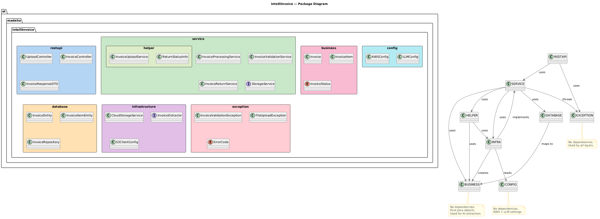

# Package Diagram

## Overview

This document describes the package structure and dependencies
of the IntelliInvoice backend system.

---

## Package Diagram

---

## Package Descriptions

### at.madeha.intelliinvoice.restapi

**Purpose:** REST API entry layer — handles HTTP requests
and returns JSON responses.
**Key Classes:** `UploadController`, `InvoiceController`,
`InvoiceResponseDTO`
**Depends on:** service, exception

### at.madeha.intelliinvoice.service

**Purpose:** Business logic and workflow orchestration.
Coordinates upload, AI extraction, validation, and persistence.
**Key Classes:** `InvoiceProcessingService`,
`InvoiceValidationService`, `InvoiceReturnService`,
`InvoiceUploadService`, `StorageService (interface)`
**Depends on:** business, database, infrastructure, exception

### at.madeha.intelliinvoice.service.helper

**Purpose:** Helper classes and records used by the service layer.
**Key Classes:** `InvoiceUploadService`, `ReturnStatusInfo`
**Depends on:** infrastructure, business

### at.madeha.intelliinvoice.business

**Purpose:** Core business objects used for AI extraction.
Plain Java classes with no framework dependencies.
**Key Classes:** `Invoice`, `InvoiceItem`, `InvoiceStatus`
**Depends on:** nothing

### at.madeha.intelliinvoice.database

**Purpose:** JPA entities and repository for database access.
**Key Classes:** `InvoiceEntity`, `InvoiceItemEntity`,
`InvoiceRepository`
**Depends on:** business

### at.madeha.intelliinvoice.infrastructure

**Purpose:** External service integrations — AWS S3 and
Claude Sonnet AI via LangChain4j.
**Key Classes:** `CloudStorageService`, `InvoiceExtractor`,
`S3ClientConfig`
**Depends on:** service, business, config

### at.madeha.intelliinvoice.config

**Purpose:** Configuration classes for AWS and LLM settings.
**Key Classes:** `AWSConfig`, `LLMConfig`
**Depends on:** nothing

### at.madeha.intelliinvoice.exception

**Purpose:** Custom exception and error code definitions.
**Key Classes:** `InvoiceValidationException`,
`FileUploadException`, `ErrorCode`
**Depends on:** nothing

---

## Dependency Rules

1. `business` has no dependencies — core domain is framework-free
2. `restapi` depends only on `service` and `exception`
3. `service` depends on `business`, `database`, `infrastructure`,
   and `exception`
4. `database` depends only on `business`
5. `infrastructure` depends on `service`, `business`, and `config`
6. `config` and `exception` have no dependencies
7. No cyclic dependencies are allowed