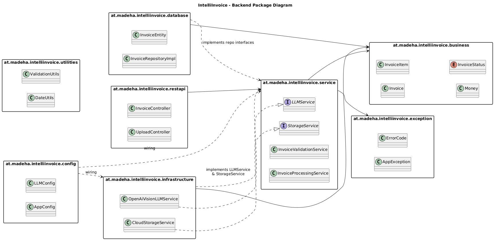

# Package Diagram

## Overview

This document describes the package structure and dependencies of the IntelliInvoice backend system.

## Package Diagram

## Package Descriptions

### Package: at.madeha.intelliinvoice.restapi

**Purpose:** REST API entry layer. Handles HTTP requests and forwards them to the Service layer.

**Dependencies:**

- `at.madeha.intelliinvoice.service` – Executes business use cases.

**Key Classes:**

- UploadController
- InvoiceController

**Visibility:**

- Public: Controllers
- Package-private: Request/response helpers

### Package: at.madeha.intelliinvoice.service

**Purpose:** Contains business workflows and service logic. Coordinates invoice processing, validation, and external
services via interfaces.

**Dependencies:**

- `at.madeha.intelliinvoice.business` – Uses business entities.
- `at.madeha.intelliinvoice.exception` – Uses custom exceptions.

**Key Classes:**

- InvoiceProcessingService
- InvoiceValidationService
- LLMService (interface)
- StorageService (interface)

**Visibility:**

- Public: Service classes and interfaces
- Package-private: Internal helper classes

### Package: at.madeha.intelliinvoice.business

**Purpose:** Contains the core business model. Independent of frameworks and external systems.

**Dependencies:**  
None

**Key Classes:**

- Invoice
- InvoiceItem
- Money
- InvoiceStatus (enum)

**Visibility:**

- Public: Business entities and value objects
- Package-private: Internal business rules (if needed)

### Package: at.madeha.intelliinvoice.database

**Purpose:** Handles database access and data persistence.

**Dependencies:**

- `at.madeha.intelliinvoice.business` – Maps database data to business objects.
- `at.madeha.intelliinvoice.service` – Implements repository interfaces.

**Key Classes:**

- InvoiceRepositoryImpl
- InvoiceEntity

**Visibility:**

- Public: Repository implementations
- Package-private: Database helpers/mappers

### Package: at.madeha.intelliinvoice.infrastructure

**Purpose:** Handles external integrations such as Vision LLM and cloud storage.

**Dependencies:**

- `at.madeha.intelliinvoice.service` – Implements service interfaces.
- `at.madeha.intelliinvoice.business` – Creates business objects.

**Key Classes:**

- OpenAiVisionLLMService
- CloudStorageService

**Visibility:**

- Public: Adapter implementations
- Package-private: Provider-specific helpers

### Package: at.madeha.intelliinvoice.config

**Purpose:** Contains configuration classes for application setup.

**Dependencies:**  
None (used only for wiring and configuration)

**Key Classes:**

- AppConfig
- LLMConfig

**Visibility:**

- Public: Configuration classes
- Package-private: Constants

### Package: at.madeha.intelliinvoice.exception

**Purpose:** Contains custom exception classes and error definitions.

**Dependencies:**  
None

**Key Classes:**

- AppException
- ErrorCode

**Visibility:**

- Public: Custom exception types
- Package-private: Internal exception helpers

### Package: at.madeha.intelliinvoice.utilities

**Purpose:** Contains shared helper and utility classes.

**Dependencies:**  
None

**Key Classes:**

- DateUtils
- ValidationUtils (optional)

**Visibility:**

- Public: Utility classes
- Package-private: Internal helper methods

## Package Design Principles

### Layering

The system follows a layered structure:

- RestAPI calls Service.
- Service uses Business.
- Database and infrastructure handle technical details.
- Business remains independent of other layers.

### Dependency Rules

1. The Business package must not depend on other packages.
2. The RestAPI layer depends only on the Service layer.
3. The Service layer depends only on the Business layer.
4. Database and infrastructure implement interfaces from Service.
5. Cyclic dependencies are not allowed.

### Package Cohesion

Each package has a clear responsibility:

- RestAPI handles requests.
- Service handles business workflows.
- Business contains core business rules.
- Database handles persistence.
- Infrastructure handles external services.
- Exception handles error management.
- Utilities contains helper classes.
- Config handles application configuration.

## Package Naming Conventions

- All package names are lowercase.
- Packages are named by responsibility.
- Root package: at.madeha.intelliinvoice.

## Cyclic Dependencies

There are no cyclic dependencies.  
The dependency rules prevent circular references between packages.

## Future Package Structure

If the project grows, packages may be separated into independent modules without changing the architecture principles.