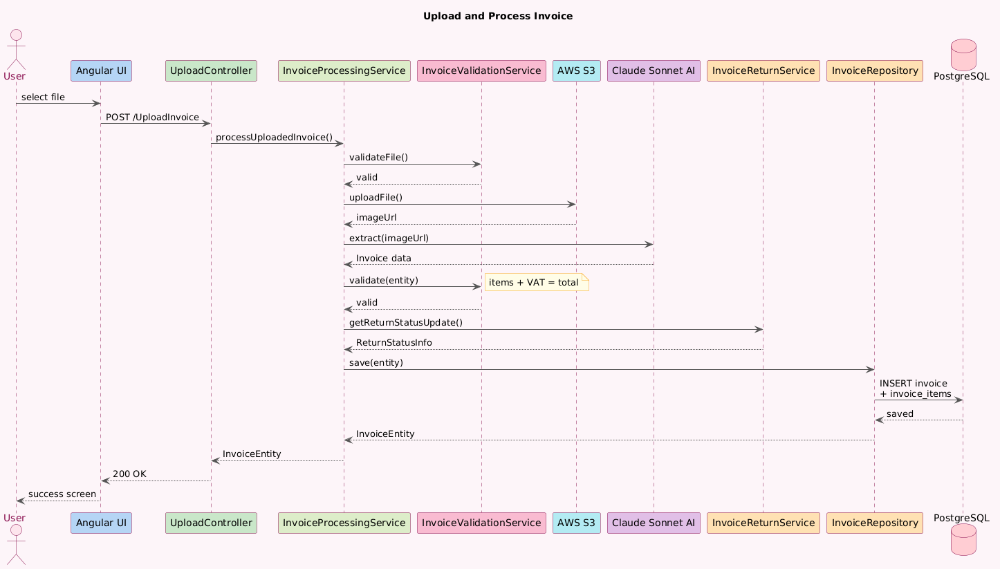
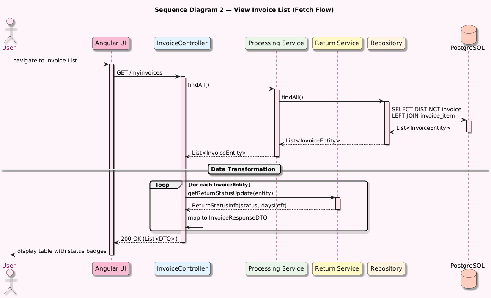
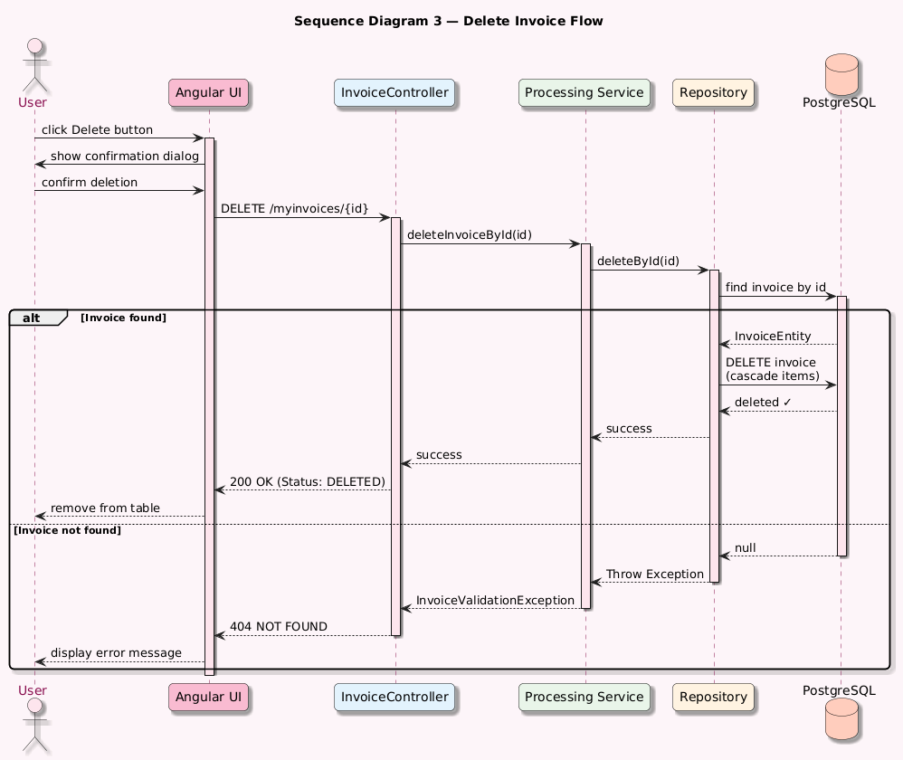

# Sequence Diagrams

## Overview

This document contains sequence diagrams showing the main
interaction flows in the IntelliInvoice system.

---

## Sequence Diagram 1: Upload and Process Invoice

### Description

The user uploads an invoice image. The system validates the file,
uploads it to AWS S3, extracts data with Claude Sonnet AI,
validates the result, and saves it to PostgreSQL.

### Diagram

---

## Sequence Diagram 2: View Invoice List

### Description

The user opens the invoice list. The system loads all invoices
from PostgreSQL and calculates return status for each one.

### Diagram

---

## Sequence Diagram 3: Delete Invoice

### Description

The user deletes an invoice. The system removes the invoice
and all its line items from PostgreSQL.

### Diagram

---

## Error Handling

All errors are caught by the Quarkus backend and returned
to Angular as JSON with a specific error code:

| Error Code             | Scenario                           |
|------------------------|------------------------------------|
| `INVALID_FILE_FORMAT`  | Wrong file type uploaded           |
| `FILE_UPLOAD_FAILED`   | AWS S3 unavailable                 |
| `INVALID_INVOICE_DATA` | AI extraction failed or math error |
| `DATABASE_ERROR`       | PostgreSQL unavailable             |
| `INVOICE_NOT_FOUND`    | Invoice ID does not exist          |